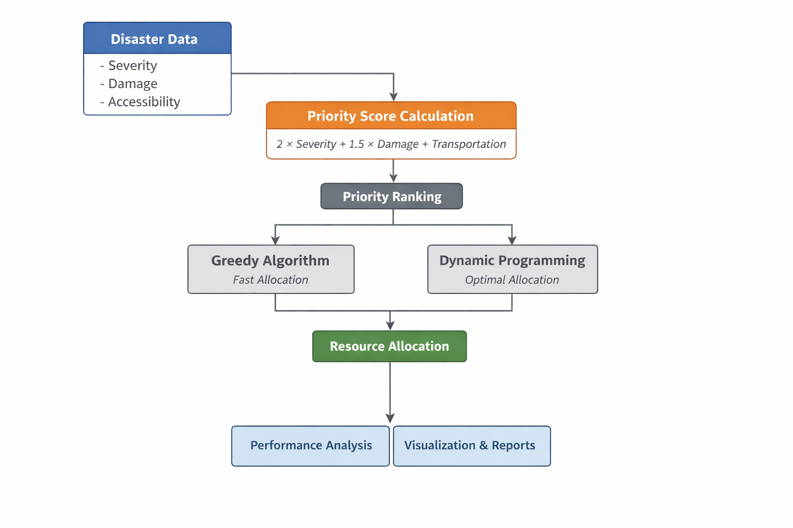

<a id="readme-top"></a>

<p align="center">
  
</p>

<h1 align="center">Emergency Resource Allocation System</h1>

<p align="center">
  Intelligent system for optimizing emergency resource allocation using algorithmic decision-making.
</p>

<br>

## Table of Contents

1. [Overview](#overview)  
2. [Key Features](#key-features)  
3. [Getting Started](#getting-started)  
4. [Usage](#usage)  
5. [Technical Details](#technical-details)  
6. [License](#license)

<p align="right">(<a href="#readme-top">back to top</a>)</p>
<br>

<br>

## Overview

This project simulates a disaster response system that allocates limited emergency resources efficiently during earthquake scenarios.

### System Architecture

<p align="center">
  
</p>

<p align="center">
  High-level workflow of the emergency resource allocation system
</p>

It demonstrates how algorithmic decision-making can improve response effectiveness under constraints.

Core components include:
- Multi-factor priority scoring
- Optimization algorithms
- Performance evaluation

<p align="right">(<a href="#readme-top">back to top</a>)</p>
<br>

<br>

## Key Features

- Multi-factor priority scoring system  
- Greedy optimization for fast allocation  
- Dynamic programming for optimal comparison  
- Performance benchmarking  
- Visualization of allocation and runtime  
- Trade-off analysis between speed and optimality  

<p align="right">(<a href="#readme-top">back to top</a>)</p>
<br>

<br>

## Getting Started

### Requirements

- Python 3.10+
- pip
- Jupyter Notebook

### Installation

```bash
pip install numpy pandas matplotlib
```

### Run

```bash
jupyter notebook
```

Open:

```text
Emergency_Resource_Allocation_Algorithm_(Earthquake).ipynb
```

<p align="right">(<a href="#readme-top">back to top</a>)</p>
<br>

<br>

## Usage

- Define disaster regions  
- Compute priority scores  
- Allocate resources  
- Compare algorithms  
- Analyze results  

<p align="right">(<a href="#readme-top">back to top</a>)</p>
<br>

<br>

## Technical Details

### Priority Model

The system calculates a priority score based on:

- Severity (urgency)  
- Damage (impact level)  
- Accessibility (transportation ease)  

Formula:

```text
Score = 2 × Severity + 1.5 × Damage + Transportation
```

<br>

### Algorithms

**Greedy Approach**
- Sort regions by priority score  
- Allocate resources sequentially  
- Time complexity: O(n log n)  
- Advantage: fast  

**Dynamic Programming**
- Evaluates optimal allocation combinations  
- Higher computational cost  
- Advantage: optimal solution  
<br>

### Evaluation

The system compares:

- Allocation efficiency  
- Resource distribution quality  
- Runtime performance  

Key insight:

> Greedy is faster, while Dynamic Programming provides optimal results.

<p align="right">(<a href="#readme-top">back to top</a>)</p>
<br>

## License

This project is licensed under the MIT License.  
See the [LICENSE](LICENSE) file for details.

<p align="right">(<a href="#readme-top">back to top</a>)</p>
